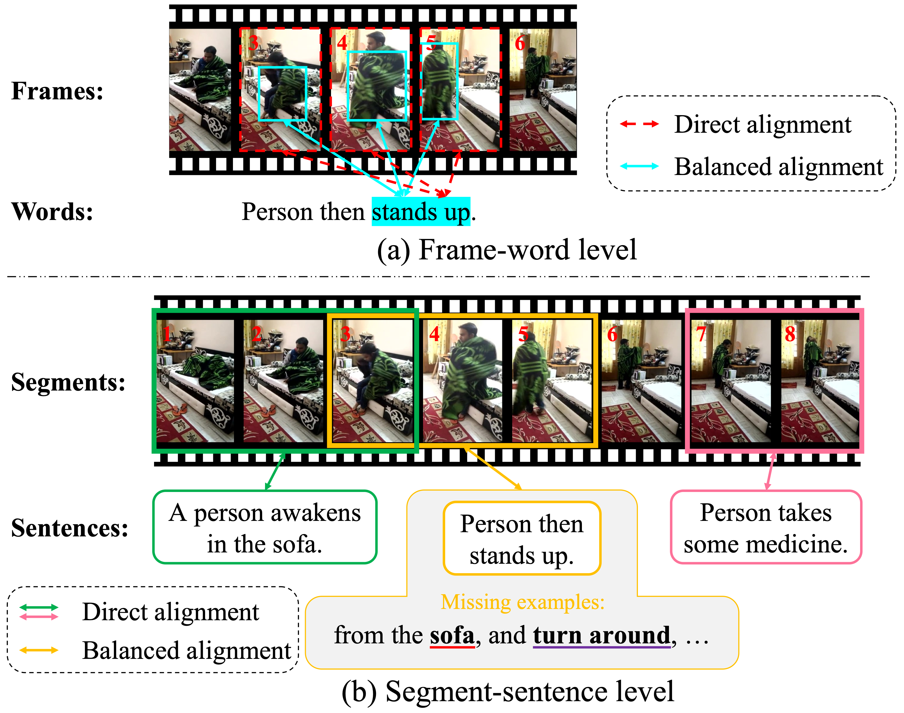

# MESM
The official code of [Towards Balanced Alignment: Modal-Enhanced Semantic Modeling for Video Moment Retrieval](https://arxiv.org/abs/2312.12155) (AAAI 2024)

## Introduction
MESM focuses on the modality imbalance problem in VMR, which means the semantic richness inherent in a video far exceeds that of a given limited-length sentence. The problem exists at both the frame-word level and the segment-sentence level.

<div align="center">
    
</div>

MESM proposes the modal-enhanced semantic modeling for both levels to address this problem.


## Prerequisites
This work was tested with Python 3.8.12, CUDA 11.3, and Ubuntu 18.04. You can use the provided docker environment or install the environment manully.

### Docker
```bash
docker pull lntzm/pytorch1.11.0-cuda11.3-cudnn8-devel:v1.0
docker run -it --gpus=all --shm-size=64g --init -v /MESM/:/MESM/ lntzm/pytorch1.11.0-cuda11.3-cudnn8-devel:v1.0 /bin/bash
```

### Conda Environment
```bash
conda create -n MESM python=3.8
conda activate MESM
conda install pytorch==1.11.0 torchvision==0.12.0 cudatoolkit=11.3 -c pytorch
pip install -r requirements.txt
```

## Data Preparation
The structure of the data folder is as follows:
```bash
data
├── charades
│   ├── annotations
│   │   ├── charades_sta_test.txt
│   │   ├── charades_sta_train.txt
│   │   ├── Charades_v1_test.csv
│   │   ├── Charades_v1_train.csv
│   │   ├── CLIP_tokenized_count.txt
│   │   ├── GloVe_tokenized_count.txt
│   │   └── glove.pkl
│   ├── clip_image.hdf5
│   ├── i3d.hdf5
│   ├── slowfast.hdf5
│   └── vgg.hdf5
├── Charades-CD
│   ├── charades_test_iid.json
│   ├── charades_test_ood.json
│   ├── charades_train.json
│   ├── charades_val.json
│   ├── CLIP_tokenized_count.txt -> ../charades/annotations/CLIP_tokenized_count.txt
│   └── glove.pkl -> ../charades/annotations/glove.pkl
├── Charades-CG
│   ├── novel_composition.json
│   ├── novel_word.json
│   ├── test_trivial.json
│   ├── train.json
│   ├── CLIP_tokenized_count.txt -> ../charades/annotations/CLIP_tokenized_count.txt
│   └── glove.pkl -> ../charades/annotations/glove.pkl
├── qvhighlights
│   ├── annotations
│   │   ├── CLIP_tokenized_count.txt
│   │   ├── highlight_test_release.jsonl
│   │   ├── highlight_train_release.jsonl
│   │   ├── highlight_val_object.jsonl
│   │   └── highlight_val_release.jsonl
│   ├── clip_image.hdf5
│   └── slowfast.hdf5
├── TACoS
│   ├── annotations
│   │   ├── CLIP_tokenized_count.txt
│   │   ├── GloVe_tokenized_count.txt
│   │   ├── test.json
│   │   ├── train.json
│   │   └── val.json
│   └── c3d.hdf5
```
All extracted features are converted to `hdf5` files for better storage. You can use the provided python script `./data/npy2hdf5.py` to convert `*.npy` or `*.npz` files to an `hdf5` file.

### CLIP_tokenized_count.txt & GloVe_tokenized_count.txt
These files are built for masked language modeling in FW-MESM, and they can be generated by running
```bash
python -m data.tokenzied_count
```

- `CLIP_tokenized_count.txt`
    
    Column 1 is the word_id tokenized by the CLIP tokenizer, column 2 is the times the word_id appears in the whole dataset.

- `GloVe_tokenized_count.txt`
    
    Column 1 is the splited word in a sentence, column 2 is its tokenized id for GloVe, and column 3 is the times the word appears in the whole dataset.


### Charades Features
We provide the merged `hdf5` files of *CLIP* and *SlowFast* features [here](). However, *VGG* and *I3D* features are too large for our network drive storge space. In fact, we just followed [QD-DETR](https://github.com/wjun0830/QD-DETR) to get video features for all extractors. They provide detailed ways to obtain features, see this [link](https://github.com/wjun0830/QD-DETR/issues/1#issuecomment-1493414922).

`glove.pkl` records the necessary vocabulary for the dataset. Specifically, it contains the most common words for MLM, the wtoi dictionary, and the id2vec dictionary. We use the `glove.pkl` from [CPL](https://github.com/minghangz/cpl/blob/main/data/charades/glove.pkl), which can also be built from the standard `glove.6B.300d`.


### QVHighlights Features
Same as [QD-DETR](https://github.com/wjun0830/QD-DETR), we also use the official feature files for QVHighlights dataset from [Moment-DETR](https://github.com/jayleicn/moment_detr), which can be downloaded [here](https://drive.google.com/file/d/1Hiln02F1NEpoW8-iPZurRyi-47-W2_B9/view?usp=sharing), and merge them to `clip_image.hdf5` and `slowfast.hdf5`.

### TACoS Features

## Trained Models
| Dataset | Extractors | Download Link |
| :--: | :--: | :--: |
| Charades-STA | C+SF, C | [OneDrive](https://mailustceducn-my.sharepoint.com/:f:/g/personal/liuzhihang_mail_ustc_edu_cn/EnpsfEa7bl5DoLINN0vlHYwBf_pNBSL1-uc5Mm34NwioYg?e=zqwtZD) |

## Training

## Evaluation

## Citation

## Acknowledgements

