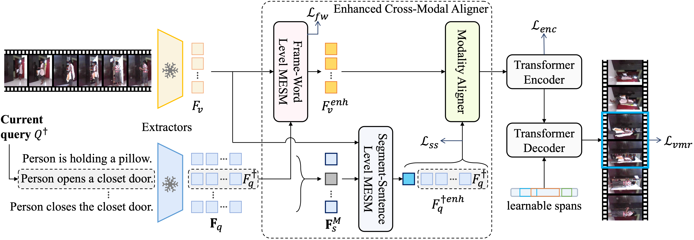

# MESM
The official code of [Towards Balanced Alignment: Modal-Enhanced Semantic Modeling for Video Moment Retrieval](https://arxiv.org/abs/2312.12155) (AAAI 2024)

# Introduction
MESM focuses on the modality imbalance problem in VMR, which means the semantic richness inherent in a video far exceeds that of a given limited-length sentence. The problem exists at both the frame-word level and the segment-sentence level.


MESM proposes the modal-enhanced semantic modeling for both levels to address this problem.


# Prerequisites
This work was tested with Python 3.8.12, CUDA 11.3, and Ubuntu 18.04. You can use the provided docker environment or install the environment manully.

## Docker
```bash
docker pull lntzm/pytorch1.11.0-cuda11.3-cudnn8-devel:v1.0
docker run -it --gpus=all --shm-size=64g --init -v /MESM/:/MESM/ lntzm/pytorch1.11.0-cuda11.3-cudnn8-devel:v1.0 /bin/bash
```

## Conda Environment
```bash
conda create -n MESM python=3.8
conda activate MESM
conda install pytorch==1.11.0 torchvision==0.12.0 cudatoolkit=11.3 -c pytorch
pip install -r requirements.txt
```

# Data Preparation


# Trained Models
| Dataset | Extractors | Download Link |
| :--: | :--: | :--: |
| Charades-STA | C+SF, C | [OneDrive](https://mailustceducn-my.sharepoint.com/:f:/g/personal/liuzhihang_mail_ustc_edu_cn/EnpsfEa7bl5DoLINN0vlHYwBf_pNBSL1-uc5Mm34NwioYg?e=zqwtZD) |

# Training

# Evaluation

# Citation

# Acknowledgements

